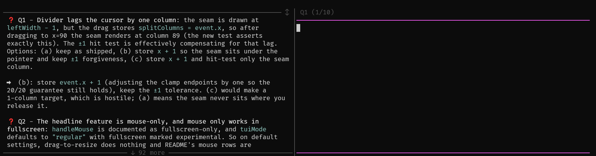

# grilling-questions

A [pi](https://github.com/earendil-works/pi-coding-agent) extension that turns the agent's questions into an answer form. When the agent ends its turn with numbered questions - `❓ Q1: …`, `❓ Q2: …` - they appear in a scrollable pane beside your input editor instead of just being text you have to quote back by hand.



## How it works

- Any assistant message containing lines starting with `❓ Qn` is parsed into questions and shown in the left pane, styled like the transcript. The right pane is the normal editor, one question at a time - a header above it shows which one is active (`Q2 (2/5)`).
- The `│` column between the panes is draggable: click-hold it and drag to resize the split left/right (each side keeps a 20-column minimum; the width sticks for the session). The pane's top `─` border is draggable too: drag it up/down to grow or shrink the box height (it never eats the transcript). The `↕` mark on the top border shows where the height handle is.
- Submitting sends all answers in one message:
  ```
  Q1: after the refactor, the old tests are deleted
  Q2: yes
  ```
- Typing `*` alone as an answer means *"take your recommendation"* - sent as `Qn: recommended`.
- Slash commands submitted while questions are pending pass through untouched (not recorded as answers).
- No questions in the last reply → the pane disappears and you get the plain editor back.

## Keys

| Key | Action |
| --- | --- |
| `ctrl+shift+←` / `→` | previous / next question (drafts are kept per question, and the pane scrolls to keep the active one on top) |
| `shift+↑` / `shift+↓` | scroll the pane one line |
| `shift+pageup` / `shift+pagedown` | scroll the pane a full page |
| mouse wheel | scroll the pane; falls through to transcript scrolling when the pane is at its edge |
| mouse drag on the `│` divider | resize the question pane / editor split |
| mouse drag on the top `─` border | grow / shrink the question box height |

On terminals narrower than 60 columns the pane stacks above the editor instead of side-by-side.

## Install

```
pi install git:github.com/stefano-v37/grilling-questions
```

For one-off use without installing: `pi -e git:github.com/stefano-v37/grilling-questions`.

## Development

Tests (parser + answer assembly):

```
npm test
```

## License

MIT
